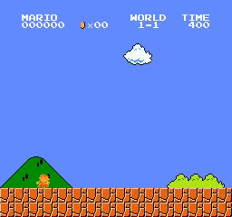

[](http://makeapullrequest.com)  
# Random Network Distillation
> Visit [RNN_Policy branch](https://github.com/alirezakazemipour/PPO-RND/tree/RNN_Policy) for RNN Policy implementation instead of CNN Policy.

Implementation of the **Exploration by Random Network Distillation** on Montezuma's Revenge Atari game. The algorithm simply consists of generating intrinsic rewards based on the novelty that the agent faces and using these rewards to reduce the sparsity of the game. The main algorithm to train the agent is **Proximal Policy Optimization** which is able to combine extrinsic and intrinsic rewards easily and has fairly less variance during training.

## [Update]
Implementation for SuperMarioBros-1-1-v0 has been added! Visit [mario branch](https://github.com/alirezakazemipour/PPO-RND/tree/mario) for the code.

## Demo

RNN Policy| CNN Policy| Super Mario Bros
:-----------------------:|:-----------------------:|:-----------------------:
| |  

## Results
RNN Policy| CNN Policy
:-----------------------:|:-----------------------:|
	               | 	
      | 
| 

## Important findings to mention

- **As it has been mentioned in the paper**, one of the obstacles that impact seriously the performance of the agent is the **Dancing with Skulls**. During the test time and also by observing the Running Intrinsic Reward during the training time, it got clear that most of the time, the agent is extremely willing to play with skulls, spiders, laser beams and etc. since those behaviors produce considerable intrinsic rewards.
- `Kernel_size` of [this part](https://github.com/openai/random-network-distillation/blob/f75c0f1efa473d5109d487062fd8ed49ddce6634/policies/cnn_policy_param_matched.py#L104) of the original implementation is wrong; it should be 3 (same as the DQN nature paper) but it is 4.
- The usage of `RewardForwardFilter` in the original implementation is definitely wrong, as it's been addressed [here](https://github.com/openai/large-scale-curiosity/issues/6#issuecomment-433981760) and solved [here](https://github.com/openai/random-network-distillation/issues/16#issuecomment-488387659).

## Table of hyper-parameters

> By using the max and skip frames of 4, max frames per episode should be 4500 so 4500 * 4 = 18000 as it has been mentioned in the paper.

Parameters          | Value
:-----------------------:|:-----------------------:
total rollouts per environment  | 30000
max frames per episode  | 4500
rollout length       	       | 128
number of environments| 128
number of epochs	   | 4
number of mini batches  | 4
learning rate                      | 1e-4
extrinsic gamma		    | 0.999
intrinsic gamma		    | 0.99
lambda		                  | 0.95
extrinsic advantage coefficient       | 2
intrinsic advantage coefficient        | 1
entropy coefficient     		    | 0.001
clip range    				       | 0.1
steps for initial normalization	      | 50
predictor proportion		     | 0.25


## Structure
```shell
PPO-RND
├── Brain
│   ├── brain.py
│   └── model.py
├── Common
│   ├── config.py
│   ├── logger.py
│   ├── play.py
│   ├── runner.py
│   └── utils.py
├── demo
│   ├── CNN_Policy.gif
│   └── RNN_Policy.gif
├── main.py
├── Models
│   └── 2020-10-20-15-39-45
│       └── params.pth
├── Plots
│   ├── CNN
│   │   ├── ep_reward.png
│   │   ├── RIR.png
│   │   └── visited_rooms.png
│   └── RNN
│       ├── ep_reward.png
│       ├── RIR.png
│       └── visited_rooms.png
├── README.md
└── requirements.txt

```
1. _Brain_ dir includes the neural networks structures and the agent decision-making core.
2. _Common_ includes minor codes that are common for most RL codes and do auxiliary tasks like: logging, wrapping Atari environments, and... .
3. _main.py_ is the core module of the code that manages all other parts and make the agent interact with the environment.
4. _Models_ includes a pre-trained weight that you can use to play or keep training by it, also every weight is saved in this directory.
## Dependencies
- gym == 0.17.3
- matplotlib == 3.3.2
- numpy == 1.19.2
- opencv_contrib_python == 4.4.0.44
- torch == 1.6.0
- tqdm == 4.50.0

## Installation
```shell
pip3 install -r requirements.txt
```
## Usage
### How to run
```bash
usage: main.py [-h] [--n_workers N_WORKERS] [--interval INTERVAL] [--do_test]
               [--render] [--train_from_scratch]

Variable parameters based on the configuration of the machine or user's choice

optional arguments:
  -h, --help            show this help message and exit
  --n_workers N_WORKERS
                        Number of parallel environments.
  --interval INTERVAL   The interval specifies how often different parameters
                        should be saved and printed, counted by iterations.
  --do_test             The flag determines whether to train the agent or play
                        with it.
  --render              The flag determines whether to render each agent or
                        not.
  --train_from_scratch  The flag determines whether to train from scratch or
                        continue previous tries.

```
- **In order to train the agent with default arguments, execute the following command** (You may change the number of workers and the interval based on your desire.):
```shell
python3 main.py --n_workers=128 --interval=100
```
- **If you want to keep training your previous run, execute the following:**
```shell
python3 main.py --n_workers=128 --interval=100 --train_from_scratch
```
- **If you want  the agent to play, execute the following:**
```shell
python3 main.py --do_test
```
### Hardware requirements
- **The whole training procedure with 32 workers can be done on Google Colab and it takes 2 days of training, thus a machine with a similar configuration would be sufficient, but if you need a more powerful free online GPU provider and to increase the number of environments to 128 and above, take a look at [paperspace.com](paperspace.com)**.
## References
1. [_Exploration by Random Network Distillation_, Burda et al., 2018](https://arxiv.org/abs/1810.12894)
2. [_Proximal Policy Optimization Algorithms_, Schulman et al., 2017](https://arxiv.org/abs/1707.06347)

## Acknowledgement 
1. [@jcwleo](https://github.com/jcwleo) for [random-network-distillation-pytorch](https://github.com/jcwleo/random-network-distillation-pytorch).
2. [@OpenAI ](https://github.com/openai) for [random-network-distillation](https://github.com/openai/random-network-distillation).
